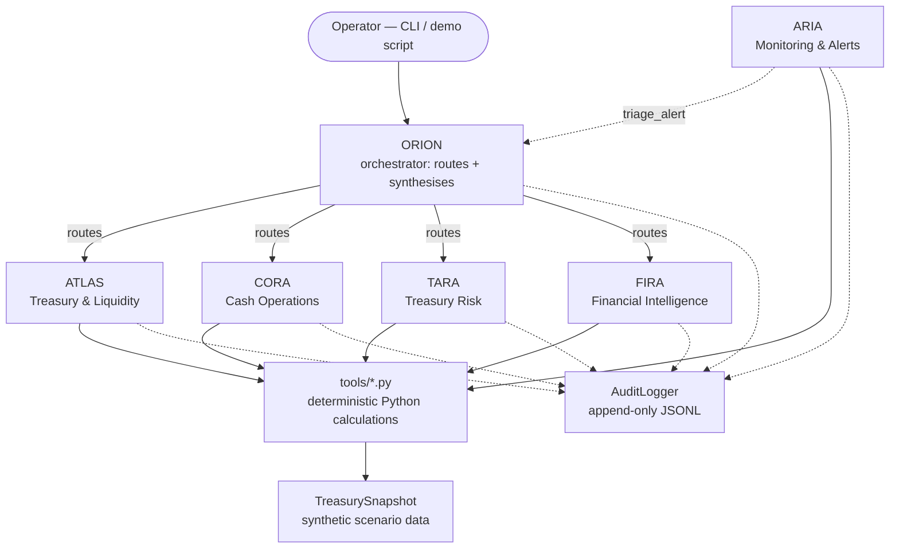

# TreasuryAI

A multi-agent AI platform for finance and treasury decision support. It combines
deterministic Python financial tools with LLM-powered reasoning agents (ORION,
ATLAS, CORA, TARA, FIRA, ARIA) to produce auditable, human-reviewable
recommendations. All data is synthetic; there is no execution engine.

## Architecture



LLMs choose which tool to call and interpret the result; they never do the
arithmetic themselves (ADR-001) — every number in a response traces back to
a call in the audit log. ORION never invokes ARIA directly; ARIA reaches
ORION the other way, via a triage request when it flags a CRITICAL/HIGH
alert. See [phases/](phases/) for what was actually built, phase by phase,
including every design decision and deviation from the original plan.

## Install

```bash
python -m venv .venv
source .venv/bin/activate   # Windows: .venv\Scripts\activate
pip install -r requirements.txt
```

## Configure

```bash
cp .env.example .env
# then set ANTHROPIC_API_KEY in .env
```

## Run

```bash
# Interactive CLI (or `python main.py <command>` for a one-shot run)
python main.py

# Scripted end-to-end demo: all 5 workflows in sequence
python scripts/demo.py --scenario liquidity_stress
```

Commands: `brief`, `stress-test`, `risk-review`, `alerts`, `ask <question>`, `quit`.

**Want a live, interactive demo in a browser** (e.g. for presenting the
system to an audience)?

```bash
python scripts/web_ui.py --scenario base_case
```

Opens `http://127.0.0.1:8765` — a real-time chat UI wired to the exact same
`TreasurySession` as the CLI: real specialist agents, real `tools/*.py`
calls, real audit log, a real click-to-approve/reject flow for pending
recommendations. Built entirely on Python's standard library
(`http.server`) — no new dependency, honoring the project's original "no
web framework" decision. Requires a real `ANTHROPIC_API_KEY`; without one
it shows the same configuration error `main.py` does, in the chat window.
This is a demo/presentation tool, not part of the audited application
surface, so unlike `agents/`, `tools/`, `models/`, `core/`, and `data/` it
has no automated test suite.

**No `ANTHROPIC_API_KEY` / don't want to spend anything?**
`python scripts/demo_offline.py` runs the exact same orchestration — real
tool execution, real audit log, real approval-gate flow, real Rich
rendering — with the LLM replaced by scripted responses (the same
`MockLLMClient` mechanism every automated test uses, ADR-011). It shows the
full architecture working end-to-end; the one thing it can't show is live
model reasoning, since that part is canned rather than generated.

## Test

```bash
pytest tests/ --cov
```

## Project status

**All 8 implementation phases complete.** Scaffolding, data models, synthetic
data layer, all 32 financial tools + tool registry, LLM client + audit
logger, all five specialist agents, the ORION orchestrator, the CLI + demo
script, and final documentation/coverage polish — see [phases/](phases/) for
a per-phase writeup of what was built, every design decision, and every real
bug found and fixed along the way. `pytest tests/ --cov` currently reports
335 tests, 99% project-wide (the only gap is two `if __name__ == "__main__":`
guards exercised by subprocess tests but not tracked by in-process coverage).

## Layout

```
agents/   # ORION orchestrator + specialist agents (ATLAS, CORA, TARA, FIRA, ARIA)
tools/    # Deterministic Python financial calculation functions
models/   # Pydantic data models (financial, requests, responses, audit)
data/     # Synthetic data loader and scenario files
core/     # Shared infrastructure (config, LLM client, audit log, tool registry)
tests/    # Unit and integration tests
```
